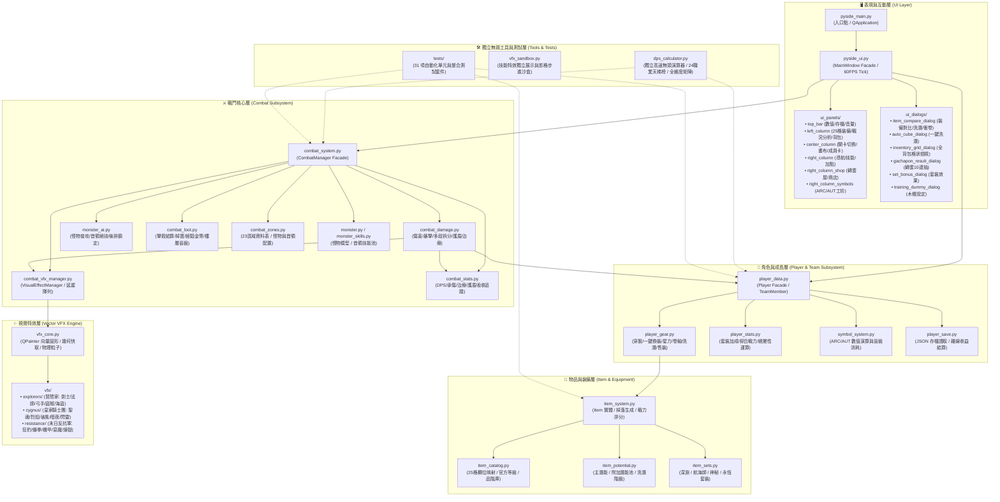

# 《新楓之谷：放置遠征隊》系統架構全景指南 (ARCHITECTURE.md)

> **專案定位**：基於 PySide6 (Qt6) 驅動的高效能、低相依、模組化放置類 RPG。  
> **核心特色**：24 正統職業、192 招正版技能、25 格新楓之谷裝備欄位、23 個冒險區域（經典 + 6 ARC + 7 AUT）、獨立無損高速戰鬥演算器。  
> **使用目標**：所有開發者與 AI Agent 在進行**任何程式碼修改或架構擴充前，必須優先研讀本文件**，以確保系統架構嚴謹性、模組低耦合與向下相容性。

---

## 1. 系統分層全景架構圖 (System Architecture Diagram)



---

## 2. 核心設計模式 (Architectural Patterns)

### 2.1 外觀模式 (Facade Pattern)
本專案採用嚴謹的三大門面類別，所有外部呼叫均透過門面代理，內部實作模組化拆分後**對外公開 API 簽名 100% 保持穩定**：
1. **`MainWindow` (`src/pyside_ui.py`)**：UI 總門面，組合 6 大面板與 6 大彈窗，接管 Qt 事件與主迴圈定時器。
2. **`CombatManager` (`src/combat_system.py`)**：戰鬥系統總門面，將傷害計算委派給 `combat_damage`、行為判定委派給 `monster_ai`、掉落結算委派給 `combat_loot`、區域管理委派給 `combat_zones`。
3. **`Player` (`src/player_data.py`)**：玩家數據總門面，將裝備操作委派給 `player_gear`、數值加總委派給 `player_stats`、符號系統委派給 `symbol_system`、存檔委派給 `player_save`。

### 2.2 無頭邏輯與介面完全解耦 (Headless Logic Decoupling)
戰鬥邏輯（`CombatManager`）、角色模型（`Player`、`TeamMember`）與數值公式（`combat_damage`）**嚴禁直接依賴任何 Qt GUI 元件（如 QWidget、QDialog、QMessageBox）或音效實體**。
- 音效透過虛擬播放介面 (`sound_mgr` / `SilentSound`) 接收，在無 GUI 環境下自動靜音吞吐。
- 由此使得 [`src/dps_calculator.py`](file:///c:/Users/porshawkuo/Saved%20Games/Learning/testing/pygame/src/dps_calculator.py) 能夠在不建立視窗的情況下，**於 1 秒內極速模擬 5 分鐘高精度戰鬥**（300 秒 / 6000 個邏輯幀），並能隨時進行單元測試。

### 2.3 純向量程序化 VFX 與幾何快取 (Procedural Vector VFX with Caching)
遊戲無任何外部圖片/圖檔素材依賴，所有技能特效皆由 `QPainter` 向量運算動態生成：
- **幾何路徑快取 (LRU 512)**：`vfx_core.py` 針對高頻重複形狀（魔法陣、手裡劍、高階多邊形網格）進行快取，避免重複分配 QPainterPath。
- **併發渲染上限**：`combat_vfx_manager.py` 設有最大特效併發上限（18 個），優先保留終極技能與高階爆發特效，超量自動降級或忽略，確保低階電腦 60 FPS 絕對流暢。

---

## 3. 資料流與主迴圈生命週期 (Lifecycle & Data Flow)

```mermaid
sequenceDiagram
    autonumber
    participant Timer as QTimer (60 FPS)
    participant UI as MainWindow
    participant CM as CombatManager
    participant TM as TeamMember
    participant DMG as combat_damage
    participant AI as monster_ai
    participant Loot as combat_loot

    Timer->>UI: timeout 觸發
    UI->>CM: update(dt, sound_mgr)
    
    rect rgb(30, 40, 60)
        note right of CM: 戰鬥主迴圈 (CombatManager.update)
        CM->>CM: 1. 畫面震動衰減 & 浮空飄字生命週期遞減
        CM->>CM: 2. 異常狀態結算 (灼燒/流血/凍結)
        CM->>CM: 3. 首領狀態檢查 (50%相位重置 / 30%狂暴急速 / 環境瘴氣DoT)
        CM->>CM: 4. 多段延遲隊列結算 (PendingHit)
        
        loop 隊伍成員 (Slot 0 ~ 4)
            CM->>TM: 更新技能冷卻與個人 Buff
            alt 有就緒技能 (is_ready)
                CM->>DMG: execute_member_attack(specific_skill)
            else 平砍普攻
                CM->>DMG: execute_member_attack(force_normal=True)
            end
            DMG-->>CM: 產生 VFX、浮空飄字、記錄 CombatStats
        end

        loop 存活怪物
            CM->>AI: process_monster_attack(m)
            alt 首領專屬技能就緒
                AI->>CM: execute_monster_skill(boss_skill)
            else 怪物普攻
                AI->>TM: 命中前排坦克/肉盾，take_damage(dmg)
            end
        end
    end

    opt 所有怪物陣亡
        CM->>Loot: handle_monster_killed()
        Loot->>Player: 結算 EXP、金幣、裝備/卷軸/符號碎片掉落
        Loot->>CM: 晉級下一層 (1~9層推進 / 10層首領通關)
        CM->>CM: spawn_next_monster()
    end

    UI->>UI: 輪循刷新面板文字 (Dirty-check 避免無效重繪)
```



---

## 4. 目錄結構與模組職責矩陣表 (Module Matrix)

| 目錄 / 模組名稱 | 行數規模 | 核心職責與導出內容 | 關鍵依賴 |
| :--- | :--- | :--- | :--- |
| **`src/pyside_main.py`** | ~80行 | 程式入口點，初始化 `QApplication`、載入存檔、綁定異常捕捉 | `pyside_ui`, `player_data`, `player_save` |
| **`src/pyside_ui.py`** | ~580行 | 主視窗控制中心，管理 60 FPS 定時器、各欄事件分發、全域快捷鍵 | `ui_panels/*`, `ui_dialogs/*`, `combat_system` |
| **`src/ui_panels/`** | 6個子檔 | **主畫面視圖模組群**：<br>• `top_bar.py`: 等級/經驗/金幣/存檔/音量<br>• `left_column.py`: 25格裝備/即時戰況分析/背包簡表<br>• `center_column.py`: 關卡選擇/戰鬥畫布/隊員狀態卡<br>• `right_column.py`: 頁籤導航/技能切換/共用加點<br>• `right_column_shop.py`: 轉蛋機/卷軸方塊商城<br>• `right_column_symbols.py`: ARC & AUT 符號工坊 | `player_data`, `combat_system`, `settings` |
| **`src/ui_dialogs/`** | 6個獨立彈窗 | **彈窗模組群 (每窗一檔)**：<br>• `item_compare_dialog.py`: 裝備對比/洗潛/衝卷/上鎖<br>• `auto_cube_dialog.py`: 條件式一鍵洗潛<br>• `inventory_grid_dialog.py`: 全螢幕行囊背包格狀瀏覽<br>• `gachapon_result_dialog.py`: 10連抽成果展示<br>• `set_bonus_dialog.py`: 套裝效果進度瀏覽<br>• `training_dummy_dialog.py`: 自定義木樁參數設定 | `item_system`, `player_gear`, `settings` |
| **`src/combat_system.py`** | ~530行 | **戰鬥管理器總門面**：主迴圈 (`update`)、木樁設定、日誌飄字管理、生成怪物 | `combat_damage`, `monster_ai`, `combat_loot`, `combat_zones` |
| **`src/combat_damage.py`** | ~350行 | **傷害運算引擎**：普攻/技能傷害公式、ARC/AUT 壓制與增傷、必定暴擊、無視防禦折減、多段拆分隊列、護盾與群補 | `player_data`, `combat_vfx_manager`, `combat_stats` |
| **`src/monster_ai.py`** | ~160行 | **怪物與首領 AI**：普攻索敵（優先坦克）、首領 AOE 撼地、毀滅死光（50%後排壓制）、防禦百分比減傷折算 | `monster_skills`, `combat_stats` |
| **`src/combat_loot.py`** | ~150行 | **戰鬥掉落與晉級**：金幣與經驗結算、裝備/種子戒指/艾比卷軸/符號碎片掉落、1~10層樓層突破與區域循環農怪 | `item_system`, `combat_zones` |
| **`src/combat_zones.py`** | ~340行 | **23 個冒險區域靜態資料表**（維多利亞經典、6 大 ARC 奧術之河、7 大 AUT 原初地區） | 純資料宣告 |
| **`src/combat_stats.py`** | ~120行 | **戰鬥數據即時分析器**：記錄每席位 DPS、輸出佔比、肉身承傷、護盾吸收量、治療量、陣亡次數 | 獨立模型 |
| **`src/player_data.py`** | ~500行 | **角色總門面**：`Player` 核心資料、`TeamMember` 席位模型、升級經驗曲線、加點邏輯 | `player_gear`, `player_stats`, `symbol_system`, `player_save` |
| **`src/player_gear.py`** | ~580行 | **裝備與背包管理**：穿脫裝備、一鍵神裝、劣裝批量出售、艾比卷軸強化、洗潛能、星力強化 | `item_system`, `item_catalog`, `settings` |
| **`src/player_stats.py`** | ~140行 | **屬性統計運算**：25 格裝備屬性加總、套裝門檻加成、綜合戰力評分計算 | `item_sets`, `item_catalog` |
| **`src/symbol_system.py`** | ~180行 | **符號系統**：6 種 ARC 與 7 種 AUT 升級碎片需求、金幣消耗、屬性加成公式 | 獨立數值模組 |
| **`src/item_system.py`** | ~520行 | **物品模型與掉落**：`Item` 類別、隨機掉落生成器 (`generate_loot`)、種子戒指生成、戰力評分公式 | `item_catalog`, `item_potential`, `item_sets` |
| **`src/item_catalog.py`** | ~560行 | **正統裝備規格表**：25 格欄位常數對照、官方裝備需求等級、品階庫、種子戒指規格庫 | 純資料宣告 |
| **`src/vfx_core.py`** | ~530行 | **向量繪圖核心庫**：QPainter 向量光暈 (bloom line)、緞帶斬痕、多環衝擊波、物理粒子、閃電電弧、幾何快取 | `PySide6.QtGui` |
| **`src/dps_calculator.py`** | ~540行 | **獨立高速無頭 DPS 演算器**：5 分鐘戰鬥 1 秒完成，支援 24 職業天梯榜 (多場平均)、四維交叉矩陣 (自訂輪數與 Top 5 標記) 與 5 人隨機抽籤組隊 | `combat_system`, `player_data` |

---

## 5. 核心協定與資料規格規範 (Contracts & Specs)

### 5.1 裝備欄位繼承協定 (25 Slots Slot-Binding)
- **核心設計哲學**：玩家換裝時**絕對不流失已投資的星力、卷軸與潛能**。
- **實作架構**：
  - `Player.equipped[slot_key]`：存放當前裝備的 `Item` 物件。
  - `Player.slot_enhancements[slot_key]`：存放該欄位當前的**星力等級**（0 ~ 25★）。
  - `Player.slot_scrolls[slot_key]`：存放該欄位已衝的**艾比卷軸次數與屬性累加**。
  - `Player.slot_potentials[slot_key]`：存放該欄位的**主潛能與附加潛能**（品階與 3 條詞條）。
  - 當替換裝備時，新裝備自動享有該欄位的全部強化數值！

### 5.2 多段技能倍率定義規範 (Multi-hit Rule)
- **全庫嚴格標準**：所有在 `classes_data/` 中定義的技能，其 `dmg_mult` 欄位**一律為「該技能的全段總倍率」**！
- **計算公式**：
  $$\text{單段傷害} = \frac{\text{原始總傷害}}{\text{hit\_count}}$$
  *嚴禁填寫單段倍率，否則會遭到系統雙重折除導致輸出崩跌！*

### 5.3 護盾優先抵扣協定 (Shield Absorption Protocol)
- 隊員模型 `TeamMember.take_damage(amount)` 遵循護盾 100% 吸收原則：
  1. 優先從 `target.shield` 扣除，扣除值記錄為 `shield_absorbed`。
  2. 護盾不足抵扣之剩餘量才扣除 `target.current_hp`，記錄為 `hp_lost`。
  3. 戰鬥統計器 `CombatStats.record_damage_taken(slot_idx, hp_lost, absorbed)` 同步分類記錄。

---

## 6. 開發與修改前檢查清單 (Pre-Modification Checklist)

在進行任何代碼修改、重構或功能擴充前，請逐項檢驗以下原則：

- [ ] **1. Windows 批次檔編碼禁忌**：
  - 所有專案根目錄 `.bat` 檔**必須以 Big5 (cp950) 編碼儲存**。
  - **嚴禁使用 `chcp 65001`**（會引發 Windows cmd 吃字破壞命令）。
  - `if (...)` 與 `for (...)` 區塊內的 `echo` **嚴禁出現英文半形括號 `(` `)`**，一律使用全形括號「（）」。
- [ ] **2. 模組化單一職責規範**：
  - 新增 UI 彈窗一律置於 `src/ui_dialogs/`（一彈窗一檔案）。
  - 新增主介面分頁或面板一律置於 `src/ui_panels/`。
  - 核心業務檔案控制在 400~500 行以內，避免再度產生超過千行的巨石代碼。
- [ ] **3. 向下相容存檔保護**：
  - 新增角色屬性或欄位時，必須在 `player_save.py` 與 `player_gear.ensure_player_slots()` 中提供預設值 fallback，確保舊存檔能無損平滑升級。
- [ ] **4. 單元測試回歸驗證**：
  - 任何改動完成後，必須立刻在命令列執行完整自動化測試套件：
    ```powershell
    runtime\python\python.exe -m unittest discover -s src/tests -p "test_*.py"
    ```
  - **必須確保全部 30 項測試 100% OK 通過**。
- [ ] **5. 科學數值平衡驗收**：
  - 若修改職業技能或數值，必須執行獨立計算器驗證天梯與隊伍生存力：
    ```powershell
    runtime\python\python.exe src/dps_calculator.py -a
    ```

